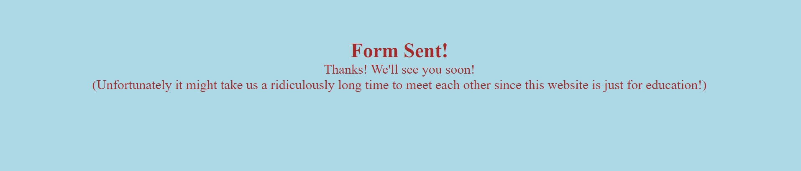

[View the site live here!](https://masorr.github.io/local-archery-club/)

This site is not a real club.
The club, its number, address and info are made up and the images are taken from www.pexels.com

# Local Archery Club

Local Archery Club is a website for people who love archery, meant for both first-timers and regular practicioners in Uppland, Sweden. The site is targeted towards archers who want a location to practice, socialice and have access to instructors at scheduled times.

## Features

---

### Existing Features

- **Navigation Bar**

  - Featured on all three pages (and fourth hidden which is confirmation.html). Fully responsive and includes links to logo, home, about and contact and is the same on each page for easy navigation.
  - Section allows user to easily navigate on all devices without the necessity of using the 'back' button.

- **The landing page image**

  - The first image show a child and several adults exercising archery. Meant to be attractive for beginners, showing people of all ages and showing a social environment.

- **Middle Sections**

  - The first part of the middle section explains core information. Beginning with that everyone is welcome.
  - The second image shows a young adult. Meant to reinforce that the club is also meant for adults.
  - Latter part of the middle section explains other core information. Beginning with information about newcomers. Then explaining what isn't allowed in the club and what it's meant for. Then finally showing pricing information.
  - The information is meant to be kept short and simple together with an accompanying image for easy reading.

- **Times Table Section**

  - This section is present on every page above the footer as an easy and simple reminder of what times the users can visit the club.
  - This section will be updated should the times change.

- **The Footer**

  - The footer section contains the number for the club as well as its address on the left side. It contains relevant social media for Local Archery Club on its right side with clickable icons for easily taking the user to respective site.
  - The footer encourages users to stay in contact with Local Archery Club's social media.

- **About landing page**

  - The first image on the about page replaces the hero image from the home page. This is a visual aid to inform the user that they are not on the home page.
  - The image shows a focused shot of a person wielding a bow and ready with an arrow. It's meant to summarise what the site is about: which is archery.

- **About section**

  - The about section explains more in detail who is the target audience.
  - It explains for which age group it's for, that it's for both new, experienced and those in between, that they can borrow or bring their own equipment, and that there are instructors present. It explains that they can also hang around and watch, sit, socialize and drink coffee or tea.
  - It shows a gallery to keep the viewer interested, to show what it's like on the range, and to visually represent some of what was written in the 'Freedom' heading. It shows an archer in a wheelchair, an image of an experienced archer, an image of an archer with an instructor, and an image of two children practicing archery.
  - The latter part in 'Straightforward' finishes up the section and encourages the user to visit their range.
  - The bottom of the section contains a clickable icon meant especially for beginners that takes the user to a tutorial on www.youtube.com.
  - The bottom of the section also contains an image of one of the archers from the image gallery, smiling towards the camera. Showing he's having fun and that he's likely a regular practicioner.

- **Contact**

  - This page allows the user to sign up to Local Archery Club. The user will be required to fill in their first name, last name and email address.
  - They're told that if they want, they can leave a message and there's a clickable 'call!' link which will take the user to the footer where the club's number is.
  - The message is optional, they can fill it in or leave it empty.

  

- **Confirmation**

  - This page will be loaded once the form on the contact page has successfully been sent. It confirms that the user's form has been sent and received.

### Features Left to Implement

- Add change language button next to logo. Since the page is meant to be a local club in sweden, original language should be swedish. Should be a simple button showing the flag of the country to inform which language the site is currently on.

## Design

---

- **Wireframes**

  - The initial home page wireframe.
    
  - Initial about page wireframe.
    
  - Initial contact page wireframe.
    

- **Wireframe / End Design Likeness**

  - Home page

    - Image on right is taller, taking up the right space. Price heading is placed on left. No crossbows heading is added.
    - The uploaded image was taller than expected and formed the new idea of the end design, which result was more aesthetically pleasing.
    - **Reasons**: Better design, clarifying what's prohibited.

  - About page

    - Image gallery added.
    - Link to youtube tutorial and final image added.
    - **Reasons**: Suggested by mentor. Adds more information for what the club is about, and makes the page more attractive.

  - Contact page

    - Removed payments and questions paragraph between form and logo.
    - **Reasons**: Suggested by mentor. Not needed.

- **Colours**

  - Lightblue background is chosen because it is a relaxing/cool colour. Meant to instill calmness and evoking a "freedom of outdoors skyview" feeling.
  - Brown color is chosen to give a natural and "woody" feeling.

## Testing

---

### Manual Testing

### Validator Testing

- HTML
  - No errors were returned when passing through the official [W3C validator](https://validator.w3.org/nu/?doc=https%3A%2F%2Fcode-institute-org.github.io%2Flove-running-2.0%2Findex.html)
- CSS
  - No errors were found when passing through the official [(Jigsaw) validator](https://jigsaw.w3.org/css-validator/validator?uri=https%3A%2F%2Fvalidator.w3.org%2Fnu%2F%3Fdoc%3Dhttps%253A%252F%252Fcode-institute-org.github.io%252Flove-running-2.0%252Findex.html&profile=css3svg&usermedium=all&warning=1&vextwarning=&lang=en#css)

### Media

tested on microsoft edge, mozilla firefox and chrome

In addition, you should mention in this section how your project looks and works on different browsers and screen sizes.

### Fixed Bugs

- Media screen when max-width go below 760px, menu jumps down below logo. However the menu is reversed, beginning with contact about home instead of home about contact.
  - Bug was fixed when using px instead of % in width for paddings and margins.

### Unfixed Bugs

- Send button on form is clickable only on 'Send!' text instead of the whole button.

## Deployment

---

This section should describe the process you went through to deploy the project to a hosting platform (e.g. GitHub)

- The site was deployed to GitHub pages. The steps to deploy are as follows:
  - In the GitHub repository, navigate to the Settings tab
  - From the source section drop-down menu, select the Master Branch
  - Once the master branch has been selected, the page will be automatically refreshed with a detailed ribbon display to indicate the successful deployment.

The live link can be found here - https://code-institute-org.github.io/love-running-2.0/index.html

## Credits

### Content

- HTML, CSS, layout, structuring and understanding of concepts was made with the help by the course material from Code Institute and inspired particularly by the Love Running project.
- HTML form and CSS for the form in contact was taken from Love Running project at the Code Institute program. Some attributes and elements have been changed but it has been used as the template.
- All icons were taken from fontawesome.
- Code for styling with flex display for centering images on about page https://blog.hubspot.com/website/center-an-image-in-html
- The flex-wrap wrap came from https://css-tricks.com/snippets/css/a-guide-to-flexbox/
- README template was copied from Love Running Project given by Code Institute.

### Media

- All images were taken from pexels.com https://www.pexels.com/
  - images by Mikhail Nilov https://www.pexels.com/@mikhail-nilov/
    - file:///workspaces/local-archery-club/assets/images/pex-mn-young-male.jpg
    - file:///workspaces/local-archery-club/assets/images/pex-mn-wheelchair-archer.jpg
    - file:///workspaces/local-archery-club/assets/images/pex-mn-wheelchair-archer-smile.jpg
    - file:///workspaces/local-archery-club/assets/images/pex-mn-instructor.jpg
    - file:///workspaces/local-archery-club/assets/images/pex-mn-hands.jpg
  - images by RDNE Stock project https://www.pexels.com/@rdne/
    - file:///workspaces/local-archery-club/assets/images/pex-rsp-experienced-archer.jpg
    - file:///workspaces/local-archery-club/assets/images/pex-rsp-children.jpg
    - file:///workspaces/local-archery-club/assets/images/pex-rsp-child-and-adults.jpg
    - file:///workspaces/local-archery-club/assets/images/pex-rsp-bows.jpg

## Other General Project Advice

---

Below you will find a couple of extra tips that may be helpful when completing your project. Remember that each of these projects will become part of your final portfolio so it’s important to allow enough time to showcase your best work!

- One of the most basic elements of keeping a healthy commit history is with the commit message. When getting started with your project, read through [this article](https://chris.beams.io/posts/git-commit/) by Chris Beams on How to Write a Git Commit Message

  - Make sure to keep the messages in the imperative mood

- When naming the files in your project directory, make sure to consider meaningful naming of files, point to specific names and sections of content.

  - For example, instead of naming an image used ‘image1.png’ consider naming it ‘landing_page_img.png’. This will ensure that there are clear file paths kept.

- Do some extra research on good and bad coding practices, there are a handful of useful articles to read, consider reviewing the following list when getting started:
  - [Writing Your Best Code](https://learn.shayhowe.com/html-css/writing-your-best-code/)
  - [HTML & CSS Coding Best Practices](https://medium.com/@inceptiondj.info/html-css-coding-best-practice-fadb9870a00f)
  - [Google HTML/CSS Style Guide](https://google.github.io/styleguide/htmlcssguide.html#General)

Getting started with your Portfolio Projects can be daunting, planning your project can make it a lot easier to tackle, take small steps to reach the final outcome and enjoy the process!
